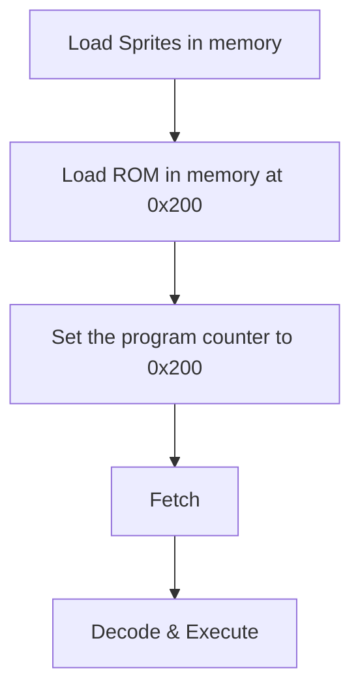
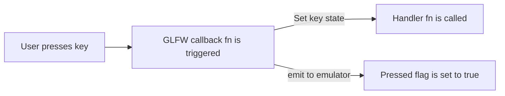

# Components of Chip-8

Chip8 has the following components in its context/specification:

1. 4KByte memory
2. 32 Byte stack
3. 16 1-Byte registers
4. Special 2-Byte register called Program Counter (PC)
5. 2 special registers
    - 1-Byte delay register
    - 1-Byte sound register
6. 1-Byte stack pointer
7. A framebuffer (display) of size 64 x 32

# Execution flow in Chip-8

The very basic flow of Chip-8 is as follows:

# Execution flow in Chip-8 Emulator

Pipeline used in the project for Emulation:

I kept the Decode & Excecute step to be done together because chip-8 is a relatively simple emulator with 35 opcodes/instructions.

# How keyboard is handled in this given project

The design issue that I faced here was that I was not able to properly visualize how glfw windowing system would control the emulator keyboard state. On figuring out the separation, here is the pipeline I came up with.

